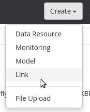
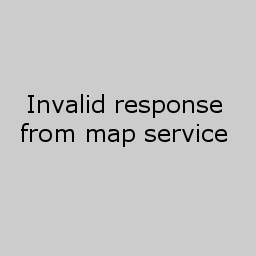

# UKCEH metadata catalogue

[](https://doi.org/10.5281/zenodo.14930462)

[Introduction for developers](docs/introduction.md)

## Installation

### Running the application

The recommended way to run the application is with Docker Compose, which starts all services
including nginx, Solr, the Spring Boot application, and the webpack watcher:

```bash
# First run, or after changing the Dockerfile or entrypoint script:
docker compose up --build --watch

# Subsequent runs (reuses the built image and cached Gradle dependencies — much faster):
docker compose up --watch

# Watch mode — auto-rebuilds when build.gradle, libs.versions.toml, Dockerfile, or entrypoint-dev.sh change:
docker compose watch
```

Browse to http://localhost:8080/eidc/documents to see the catalogue populated with demo records.

Optional services can be included with profiles:

```bash
docker compose --profile hubbub up --build   # include Hubbub upload service
docker compose --profile legilo up --build   # include Legilo
docker compose --profile fuseki  up --build  # include Fuseki SPARQL
```

Local environment overrides can be placed in `override.env`.

## Project Structure

- **/datastore**  - Git-backed document store created at runtime (local development only; do not edit). The source records are in `/fixtures/datastore/REV-1/` — edit `.raw` and `.meta` files there to change the demo data that gets loaded on startup
- **/docs**       - Documentation
- **/fixtures**   - Test data
- **/java**       - Standard `gradle` project which powers the server side of the catalogue
- **/solr**       - `Solr` web application, this handles the free-text indexing and searching of the application
- **/templates**  - `Freemarker` templates which are used by the `java` application for generating the different metadata views
- **/web**        - Location of the web component of the project, this is mainly `JavaScript` and `less` style sheets

## API
[API documentation](docs/api.md)

## Endpoints
[Endpoint documentation](docs/endpoints.md)

## Enabling different features
[Configure profiles](docs/profiles.md)

## Semantic (vector) search

Semantic search uses vector embeddings via Amazon Bedrock to find conceptually related records,
even when search terms don't match document keywords exactly.

Activate with the `vector-search` Spring profile and AWS Bedrock credentials:

```bash
# override.env
SPRING_PROFILES_ACTIVE=development,server-eidc,search-basic,cache,service-agreement,upload-simple,vector-search
AWS_ACCESS_KEY_ID=...
AWS_SECRET_ACCESS_KEY=...
AWS_REGION=eu-west-2
```

Once active, users with access see a **Semantic search** toggle below the search box. Alternatively,
add `?semantic=true` directly to any search URL:

```
GET /eidc/documents?term=freshwater+invertebrate+monitoring&semantic=true
```

**Access control:** restrict the toggle to a specific Crowd group by setting
`catalogue.semantic.group=GROUP_NAME` in `override.env`. Leave empty (default) to allow
all users.

**Embedding enrichment:** to include text from supporting PDF/Word/RTF documents in the
embedding, mount them into the container and set the location property:

```yaml
# docker-compose.yml catalogue service
volumes:
  - /host/path/supporting-docs:/var/ceh-catalogue/supporting-documents:ro
environment:
  CATALOGUE_SUPPORTING_DOCUMENTS_LOCATION: /var/ceh-catalogue/supporting-documents
```

Supporting documents are expected at `{location}/{documentId}/` (one subdirectory per record).
Up to 5 documents (4 000 chars each) are extracted per record. If the property is absent,
extraction is disabled and embeddings use metadata fields only.

Documents without embeddings (e.g. newly indexed before the first flush) are excluded from
semantic results but remain fully searchable via BM25. Embeddings are generated asynchronously
every 5 minutes (configurable via `catalogue.embedding.flush-delay`).

After changing `solr/documents/conf/managed-schema`, trigger a full reindex via the admin
`/index` endpoint so all documents receive vector embeddings.

See `docs/vector-search-mcp.md` for full technical details.

## MCP server

The MCP server exposes catalogue search to external LLMs (Claude Desktop, etc.) using the
Model Context Protocol over SSE.

Add `mcp-server` to `SPRING_PROFILES_ACTIVE`:

```bash
SPRING_PROFILES_ACTIVE=development,server-eidc,search-basic,cache,service-agreement,upload-simple,mcp-server
```

Available endpoints:
- `GET  /mcp/sse`      — SSE event stream
- `POST /mcp/messages` — client-to-server messages

Available tools: `searchCatalogue`, `semanticSearch` (requires `vector-search` profile),
`getDocument`, `listCatalogues`.

## Usernames and Passwords

You will need to create a `secrets.env` file with the following. Ask one of the dev team for access to Keypass to retrieve the values. `JIRA_TOKEN` is a JIRA Personal Access Token generated for the `eidc_ingest` account (Profile → Personal Access Tokens in JIRA).

```
JIRA_TOKEN=
CROWD_PASSWORD=
DOI_PASSWORD=
HUBBUB_PASSWORD=
FUSEKI_PASSWORD=
```

## Getting started

The catalogue requires a few tools:

- Git
- Docker
- Docker Compose

Java is not required locally — the application runs entirely inside Docker.

You will then need to log in to the Gitlab Docker Registry, nb. this uses your Gitlab username/password or token, not Crowd, if they're not the same, this might catch you out.

    $ docker login registry.gitlab.ceh.ac.uk

Having installed these you can build and start the full application with:

```bash
docker compose up --build   # first run
docker compose up           # subsequent runs (faster — reuses cached Gradle dependencies)
docker compose watch        # like `up`, but auto-rebuilds on Dockerfile/build file changes
```

The EIDC catalogue is then available at http://localhost:8080/eidc/documents.

### Intellij set-up

Make sure that you have the Lombok plugin installed, if not you can download it from `settings -> Plugins -> marketplace` and search for Lombok.
Check that annotation processing is enabled in `settings -> Build, Execution, Deployment -> compiler -> Annotation processors`.


### Developing JavaScript and CSS

The `web` service in Docker Compose runs the webpack and gulp CSS watchers automatically.
Any changes to `web/src/` or `web/scss/` are rebuilt within a few seconds — refresh the
browser to see the result; no container restart is needed.

```bash
# Run JS tests (single run):
docker compose exec web npm run test
# Or on the host:
cd web && npm run test

# Lint:
cd web && npm run standard
```

#### Note — there are many uses of JQuery's `$(document).ready()` in the editor module. Do not remove them as they prevent timing issues with views of existing documents in the editor.

### Test JavaScript using Karma

      npm run test

Karma tests are found in each module in `web/src/` if you need to edit or add new tests.
For example, the tests for the editor module are in `web/src/editor/test/`.
The Karma tests are configured in `karma.conf.js`.

### Java

**Running tests:**

```bash
./gradlew :java:test
./gradlew :java:test --tests uk.ac.ceh.gateway.catalogue.search.SearchControllerTest
./gradlew :java:test --tests uk.ac.ceh.gateway.catalogue.search.SearchControllerTest.myTest
```

Run these on the host, including while `docker compose up` is running — the container keeps
its own Gradle project cache and Jena/datastore storage isolated from the host, so the two
don't lock-contend. Running Gradle via `docker compose exec catalogue ...` isn't supported:
most `@SpringBootTest` classes share the app's own storage locks with whatever the running
container is already doing, and will fail unpredictably.

After editing a `.java` file, run `./gradlew :java:compileJava` on the host — Spring DevTools
detects the new class files and restarts the application context in ~5–15s without a full
container restart.

Tests can also be run through IntelliJ using the standard run configurations.

### Spring profiles
Spring Profiles provide a way to segregate parts of your application configuration and make it only available in certain environments.
Any @Component or @Configuration can be marked with @Profile to limit when it is loaded.
The active profiles are set via the `SPRING_PROFILES_ACTIVE` environment variable in `docker-compose.yml` (and can be overridden in `docker-compose.override.yml` or `override.env`).
The catalogue contains the following Spring profiles:
##### development
The development profile runs code that is only available when developing such as the `DevelopmentUserStoreConfig.java` which makes testing code locally easier as it allows the user access to more user permissions.
##### upload-simple / upload-hubbub
Allows the user to upload their documents using `FileSystemStorageService.java` when `upload-simple` is active or the Hubbub API which `UploadService.java` interfaces with when `upload-hubbub` is active (enabled with the `-b` flag).
##### keyword-suggestions
Enables the Legilo keyword suggestion service (enabled with the `-l` flag).
##### server-eidc / server-datalabs / server-inms
The server profile e.g. `server-eidc` decides which catalogue you will use and which documents that you will use with it. For example the EIDC catalogue will use Gemini documents.
##### search-basic / search-enhanced
Select which algorithm Solr uses to search for documents.
##### service-agreement
Allows the user to create online service agreements for datasets.
##### exports
Enables SPARQL/RDF export endpoints; requires Fuseki (enabled with the `-f` flag).
##### cache
Enables EHCache-based response caching. Active by default in development.
##### metrics
Creates the embedded sqlite database for the metric reporting.

### Developing LESS
In the web directory run

    npm run build-css-dev   # one-off dev build
    npm run watch-css       # watch and recompile on changes
    npm run build-css       # production build

## Adding new document types to the catalogue

See [Adding a new document type](docs/newDocumentType.md) for step-by-step instructions.

If you need to add a new document type to the catalogue like `GeminiDocument.java`,
extend your new class with `AbstractMetadataDocument.java` and configure it in the following classes:
`CatalogueMediaTypes.java`, `CatalogueServiceConfig.java`, `ServicesConfig.java` and `WebConfig.java`.
For an example of how to do this look at how the GeminiDocuments are configured in each of these classes.

## Multiple Catalogues

[Create a new catalogue](docs/new-catalogue.md).

Multiple catalogues are supported by this software.

A catalogue has its own:
- search page
- style
- editor and publisher groups
- metadata records
- document types

## Catalogue Content

A catalogue can reuse existing metadata content by linking to public metadata in
another catalogue using the Link document type.



## Remote-User

The catalogue is designed to sit behind a **Security Proxy**
see [RequestHeaderAuthenticationFilter](http://docs.spring.io/autorepo/docs/spring-security/3.2.0.RELEASE/apidocs/org/springframework/security/web/authentication/preauth/RequestHeaderAuthenticationFilter.html) which acts as the authentication source for the application. Therefore, the catalogue will respond to the `Remote-User` header and handle requests as the specified user.

To simplify development, the `DevelopmentUserStoreConfig` is applied by default. This creates some dummy users in various different groups which you can masquerade as using the Dev Bar at the top of the page.

Other users are configured in [DevelopmentUserStoreConfig](java/src/main/java/uk/ac/ceh/gateway/catalogue/config/DevelopmentUserStoreConfig.java) for the different catalogues.

## Developing Upload - Hubbub API
Getting everything running

Start with the Hubbub profile:

```bash
docker compose --profile hubbub up --build
```
### Populate the database

Postgres database needs the schema creating.

1. Checkout the Hubbub git repo, there is a script to create the schema.

2. In the Hubbub repo project directory
    ```commandline
    source venv/bin/activate
    python -m migration.schema --user gardener --password cabbages
    ```

3. Import the `migration/status.csv` file into the database
4. Back in the Catalogue project import `fixtures/upload/file.csv`

### Hubbub Javascript development

1. Run `npm run test-server` to recompile `hubbub.budnle.js` on code changes and run tests.
   1. `npm run watch` if you just want the code to recompile on changes
2. You will need access to the EIDCHELP Jira project to run the app.
3. The [Busy Buzy Bumblebees](http://localhost:8080/upload/c88921ba-f871-44c3-9339-51c5bee4024a) upload page has a [Jira issue](https://jira.ceh.ac.uk/browse/EIDCHELP-52451) in the EIDCHELP project
4. Set the requests header `remote-user: uploader` to see page as a data depositor.
   Or `remote-user: superadmin` to see it as data centre staff.

## Map Viewer

### TO DO - The Map Viewer was removed during the Catalogue upgrade, create a new one using Leaflet .
### The following notes are left over from the old map viewer which may come in use which is why I have left them in.


All requests for maps go through our catalogue api as TMS coordinates
(i.e. z, x, y). When a map request comes in, the catalogue api transforms
the z, x, y coordinates into a wms GetMap request in the EPSG:3857 projection
system. This is the projection system which is used by Google Maps style web
mapping applications.

The Catalogue api will gracefully handle certain upstream mapping failures. These failures will be represented as images so that they can be displayed by the normal mapping application.

Below are the images which are displayed and there meaning:

### Legend not found


Displayed when a Legend image is requested but one has not been specified in the GetCapabilities

### Upstream Failure


The call to the server failed for some unspecified reason, this may be because the connection failed.

### Invalid response


The upstream service returned some content, but it was not in the format which was expected. It maybe that the upstream service replied with an error message rather than an image.

### Invalid Resource


The wms get capabilities returned a malformed reference to either a GetLegend or GetMap url. This can happen if you are using a buggy web map server or a corrupt external get capabilities.


## Logging level during development

The logging level of individual components can be controlled by adding them to the service's environment in a `docker-compose.override.yml`, like the following:

```yaml
services:
  catalogue:
    environment:
      - LOGGING_LEVEL_UK_AC_CEH_CATALOGUE_GEMINI_GEOMETRY=DEBUG
```
