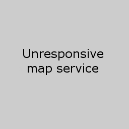

# CEH Catalogue

The CEH metadata catalogue project.

[Introduction for developers](docs/introduction.md)

## Installation

### Demo current development

The current code can be built and demoed

```commandline
docker-compose up -d --build
```
Browse to http://localhost:8080/eidc/documents to see the catalogue populated with some demo records.

### Standalone installation using published Docker images

```commandline
mkdir datastore dropbox upload
cp fixtures/datastore/REV-1/* datastore
cd datastore
git init
git add -A
git commit -m "loading example data"
cd -

```

## Project Structure

- **/docs**       - Documentation
- **/fixtures**   - Test data
- **/java**       - Standard `gradle` project which powers the server side of the catalogue
- **/schemas**    - XSD Schemas which are used to validate the various output xml files
- **/solr**       - `Solr` web application, this handles the free-text indexing and searching of the application
- **/templates**  - `Freemarker` templates which are used by the `java` application for generating the different metadata views
- **/web**        - Location of the web component of the project, this is mainly `coffeescript` and `less` style sheets

**NB:** `web/src/vendor/requirejs` needs to be left alone otherwise the build breaks

## API
[API documentation](docs/api.md)

## Endpoints
[Endpoint documentation](docs/endpoints.md)

## Enabling different features
[Configure profiles](docs/profiles.md)

## Usernames and Passwords

you will need to create a `secrets.env` file with the following

```
jira.password=FindMeInK33Pa55
crowd.password=
plone.password=
doi.password=
hubbub.password=
```

## Getting started

**NOTE:** This section is currently out-of-date and needs updating.

The catalogue requires a few tools:

- Java (OpenJDK)
- Git
- Docker
- Docker Compose

You will then need to log in to the Gitlab Docker Registry, nb. this uses your Gitlab username/password or token, not Crowd, if they're not the same, this might catch you out.

    $ docker login registry.gitlab.ceh.ac.uk

Having installed these you can then build the catalogue code base by running:

    docker-compose up -d --build

the EIDC catalogue is then available on:

    http://localhost:8080/eidc/documents

### Developing Javascript & LESS

    ./gradlew :web:grunt_concurrent

will run a process that watches the javascript and less directories and recompiles the files on any changes.

### Developing just Javascript

    ./gradlew
    ./gradlew :web:grunt_copy

Probably need to do first command in one terminal and after it has run do the second.  I used this as I couldn't get ./gradlew :web:grunt_concurrent working.

### Java

    ./gradlew web

will rebuild the minimum required steps in order to re-build the project and restart apache

to have this continuously watch for changes in the java code (not including tests)

    ./gradlew -t web

You may need to increase your watches see the answer [here](https://askubuntu.com/questions/770374/user-limit-of-inotify-watches-reached-on-ubuntu-16-04) for more details on this

If using System.out.println('foo'), you can grep it out like this:
    
    docker logs catalogue_web_1 > stdout.log 2>stderr.log && cat stdout.log | grep foo

Run single tests:
    
    ./gradlew -Dtest.single=JiraService --info test -t

--info spits out the error message and -t is watching for file changes and will re-run then

Can use package names and * in the name

[More info](https://stackoverflow.com/questions/22505533/how-to-run-only-one-test-class-on-gradle) about single file tests

## Multiple Catalogues

[Create a new catalogue](docs/new-catalogue.md).

Multiple catalogues are supported by this software.

A catalogue has its own:
- search page
- style
- editor and publisher groups
- metadata records
- document types

## Catalogue Content

A catalogue can reuse existing metadata content by linking to public metadata in
another catalogue using the Link document type.


## Remote-User

The catalogue is designed to sit behind a **Security Proxy** (
see [RequestHeaderAuthenticationFilter](http://docs.spring.io/autorepo/docs/spring-security/3.2.0.RELEASE/apidocs/org/springframework/security/web/authentication/preauth/RequestHeaderAuthenticationFilter.html) which acts as the authentication source for the application. Therefore, the catalogue will respond to the `Remote-User` header and handle requests as the specified user.

To simplify development, the `DevelopmentUserStoreConfig` is applied by default. This creates some dummy users in various different groups which you can masquerade as. The simplest way to do this is use a browser extension which applies the `Remote-User` header. I recommend **ModHeader for Chrome**.

Then set the request header:

    Remote-User: superadmin

Other users are configured in [DevelopmentUserStoreConfig](java/src/main/java/uk/ac/ceh/gateway/catalogue/config/DevelopmentUserStoreConfig.java) for the different catalogues.

## Developing Upload - Hubbub API
Getting everything running

Minimum configuration needed in `docker-compose.override.yaml`
```yaml
version: "3.7"
services:
  web:
    volumes:
      - ./templates:/opt/ceh-catalogue/templates
      - ./web/scripts/dist/main.bundle.js:/opt/ceh-catalogue/static/scripts/main.bundle.js
    environment:
      - spring.profiles.active=development,upload:hubbub,server:eidc,search:basic
      - jira.username=<your username>
```

```commandline
docker-compose -f docker-compose.yml -f docker-compose.hubbub.yml -f docker-compose.override.yml up -d --build
```
### Populate the database

Postgres database needs the schema creating.

1. Checkout the Hubbub git repo, there is a script to create the schema.

2. In the Hubbub repo project directory
    ```commandline
    . venv/bin/activate
    python -m migration.schema --user gardener --password cabbages
    ```

3. Import the `migration/status.csv` file into the database
4. Back in the Catalogue project import `fixtures/upload/file.csv`

### Javascript development

1. Run `npm run test-server` to recompile `hubbub.budnle.js` on code changes and run tests.
   1. `npm run watch` if you just want the code to recompile on changes
2. You will need access to the EIDCHELP Jira project to run the app.
3. The [Busy Buzy Bumblebees](http://localhost:8080/upload/c88921ba-f871-44c3-9339-51c5bee4024a) upload page has a [Jira issue](https://jira.ceh.ac.uk/browse/EIDCHELP-52451) in the EIDCHELP project
4. Set the requests header `remote-user: uploader` to see page as a data depositor.
   Or `remote-user: superadmin` to see it as data centre staff.

## Map Viewer

All requests for maps go through our catalogue api as TMS coordinates
(i.e. z, x, y). When a map request comes in, the catalogue api transforms
the z, x, y coordinates into a wms GetMap request in the EPSG:3857 projection
system. This is the projection system which is used by Google Maps style web 
mapping applications.

The Catalogue api will gracefully handle certain upstream mapping failures. These failures will be represented as images so that they can be displayed by the normal mapping application.

Below are the images which are displayed and there meaning:

### Legend not found


Displayed when a Legend image is requested but one has not been specified in the GetCapabilities

### Upstream Failure


The call to the server failed for some unspecified reason, this may be because the connection failed.

### Invalid response


The upstream service returned some content, but it was not in the format which was expected. It maybe that the upstream service replied with an error message rather than an image.

### Invalid Resource


The wms get capabilities returned a malformed reference to either a GetLegend or GetMap url. This can happen if you are using a buggy web map server or an corrupt external get capabilities.
